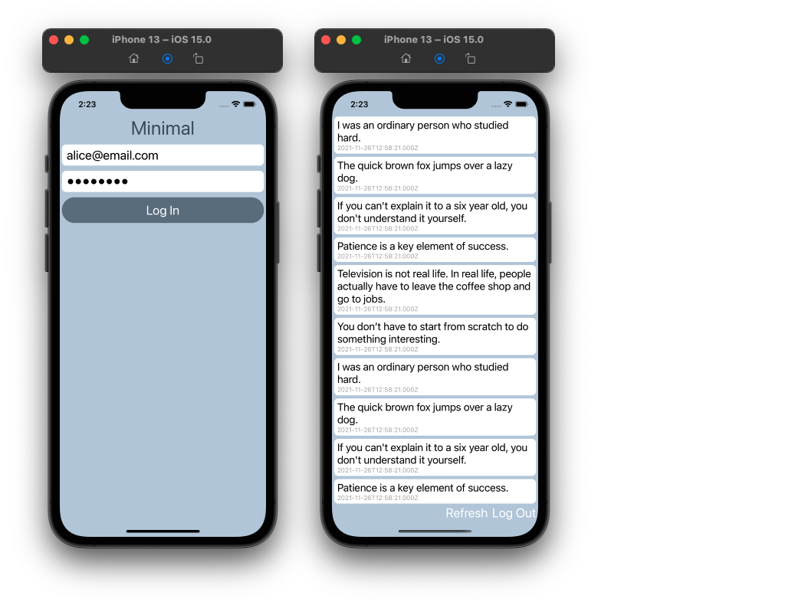

## Social Media & Cryptocurrency

This project is a prototype of a new social media
with cryptocurrency integration. It has been
written in JavaScript stack with Node.js, Express.js
and MySQL. The reference platform is Ubuntu, but
it can be run on major systems easily.

Project ตัวอย่างในคอร์ส Full Stack Engineer เป็น Social Media ที่เขียนด้วย JavaScript ทั้งระบบ 
มีหน้าสมัครสมาชิกซึ่งต้องใช้ Wallet ของ METAMASK มายืนยันก่อนที่จะสมัคร 
มีหน้า Asset Management ให้ผู้ใช้โอน Cryptocurrency เข้ามา Stake ได้บน Blockchain 
มีปุ่ม Deactivate คืนเงินให้หมดและลบ Account ออกจากระบบตามกฎหมาย PDPA 
และมีตัวอย่างของ Smart Contract ที่เขียนด้วย Solidity

มาเรียน Full Stack Engineer ที่ CODESTAR ใช้ภาษาเดียว เขียนได้ครบทุกส่วน 
ตั้งแต่ Backend, Frontend, Database, API, Web Service, Blockchain และ Cryptocurrency 
เรียน Framework ที่นิยมใช้อย่าง React, Angular, Vue.js, Node.js ที่สำคัญคือ 
ได้เขียน Application บน iOS และ Android ด้วย React Native สร้าง Ecosystem ได้ด้วยภาษาเดียว

ดูคอร์สเรียนได้ที่นี่ https://codestar.work/register


From Ubuntu:
```
git clone https://github.com/kookiatsuetrong/social
cd social
sudo mysql < schema.sql
npm install express ejs mysql cookie-parser multer
node main.js
```
